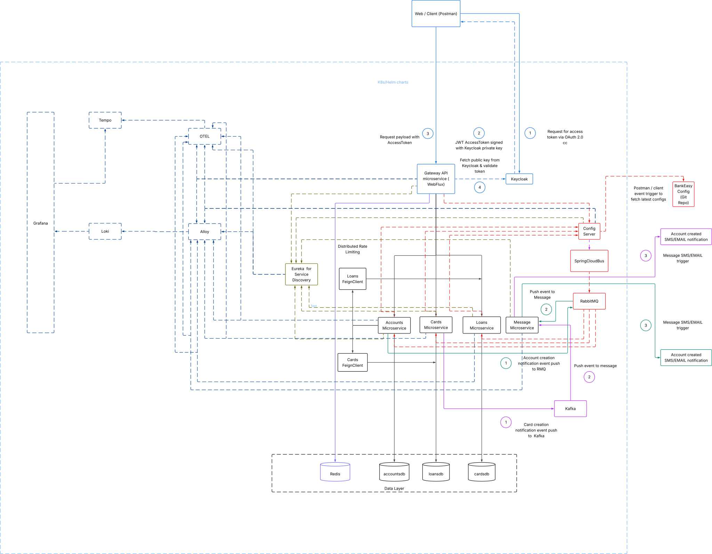

# 🏦 BankEasy - Cloud-Native Microservices Banking Platform

> Enterprise-grade microservices platform demonstrating API Gateway, dual message brokers, distributed tracing, and comprehensive observability

[](https://openjdk.java.net/)
[](https://spring.io/projects/spring-boot)
[](https://kafka.apache.org/)
[](https://kubernetes.io/)

---

## 📋 Table of Contents

- [Architecture Overview](#architecture-overview)
- [Key Features](#key-features)
- [Technology Stack](#technology-stack)
- [Quick Start](#quick-start)
- [Microservices](#microservices)
- [Communication Patterns](#communication-patterns)
- [Observability](#observability)
- [Lessons Learned](#lessons-learned)
- [API Documentation](#api-documentation)

---

## 🏗️ Architecture Overview

<div align="center" style="background-color:#0d1117; padding:14px; border-radius:10px;">
  <!-- Zoomable, clickable SVG embed for GitHub README -->
  <a href="./assets/Bankeasy.svg" target="_blank" rel="noopener">
    
  </a>
  <p style="color:#9aa7b0; font-size:12px; margin-top:8px;">Click the diagram to open full-resolution, zoomable SVG.</p>
</div>

> Note: SVG must be located at `./assets/Bankeasy.svg`. For best dark-mode appearance, ensure the SVG includes a dark background layer (example instructions below).

---

## Key Features

- Microservices architecture with **Accounts, Cards, Loans, Message** services  
- **API Gateway** with OAuth2 token validation (Keycloak), rate limiting, and circuit breakers  
- Dual message brokers: **Kafka** (event streaming) and **RabbitMQ** (config bus + inter-service queues)  
- Centralized configuration via **Spring Cloud Config** (Git-backed) + **Spring Cloud Bus** for live refresh  
- Full observability: **Prometheus**, **Grafana**, **Loki**, **Tempo** and **Alloy**  
- Per-service SQL databases (MySQL) and **Redis** for caching / rate-limiting  
- Kubernetes-ready (Helm charts), CI/CD friendly (GitHub Actions / Jenkins)

---

## Technology Stack

**Backend:** Spring Boot, Spring Cloud, Feign  
**Messaging:** Kafka, RabbitMQ  
**Auth:** Keycloak (OIDC / OAuth2)  
**Datastore:** MySQL, Redis  
**Observability:** Prometheus, Grafana, Loki, Tempo, Alloy (OTel)  
**Deployment:** Docker, Helm, Kubernetes  
**CI/CD:** GitHub Actions, Jenkins

---

## Quick Start (dev)

```bash
# example - run locally with docker-compose (dev)
docker-compose -f docker-compose.dev.yml up --build

# or use Helm for k8s (cluster must be available)
helm upgrade --install bankeasy ./k8s/helm -n bankeasy --create-namespace
